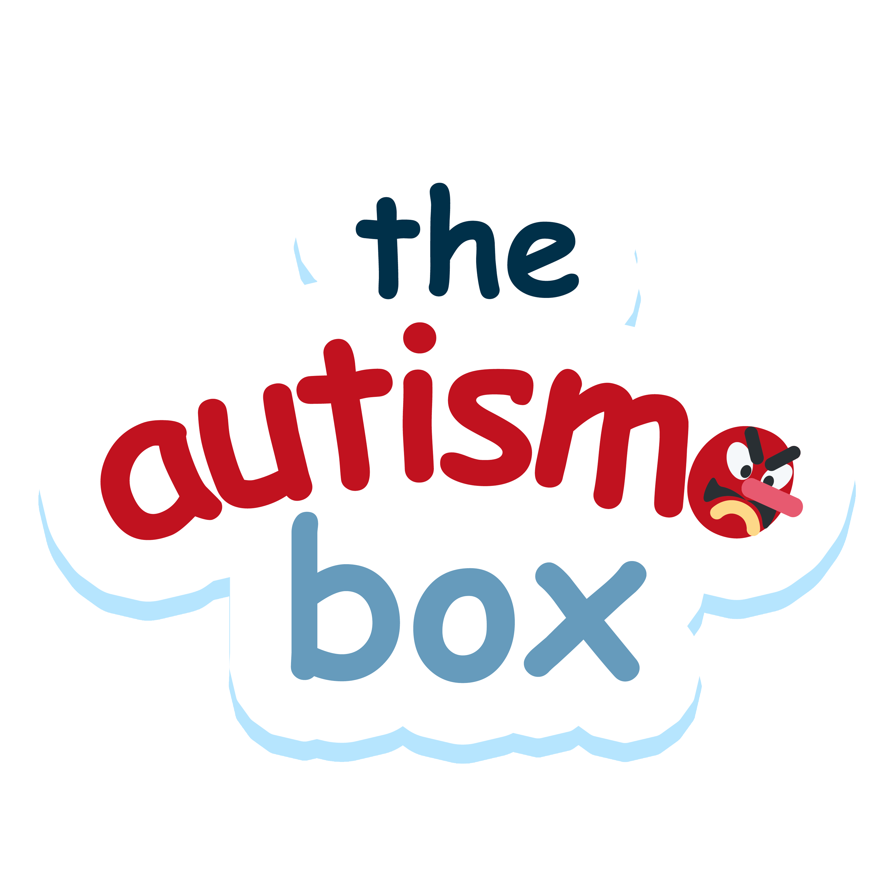

This post is meant as a quick intro to markup effects usable on Autismobox.
For a proper docks, check out [mkdocs material](https://squidfunk.github.io/mkdocs-material/reference/)


[Hover me]("Tooltip")

# Admonitions
!!! note "custom note title"
    test

!!! tip 
    test tip

!!! success
    test success

!!! danger
    test

Testing footnotes[^1]

| test        | table                                |
| ----------- | ------------------------------------ |
| `GET`       | :material-check:     Fetch resource  |
| `PUT`       | :material-check-all: Update resource |
| `DELETE`    | :material-close:     Delete resource |

```py title="code block" linenums="1" hl_lines="2 3"
def bubble_sort(items):
    for i in range(len(items)):
        for j in range(len(items) - 1 - i):
            if items[j] > items[j + 1]:
                items[j], items[j + 1] = items[j + 1], items[j]
```

The `#!python range()` function is used to generate a sequence of numbers.

=== "C"

    ``` c
    #include <stdio.h>

    int main(void) {
      printf("Hello world!\n");
      return 0;
    }
    ```

=== "C++"

    ``` c++
    #include <iostream>

    int main(void) {
      std::cout << "Hello world!" << std::endl;
      return 0;
    }
    ```

Text can be {--deleted--} and replacement text {++added++}. This can also be
combined into {~~one~>a single~~} operation. {==Highlighting==} is also
possible {>>and comments can be added inline<<}.

{==

Formatting can also be applied to blocks by putting the opening and closing
tags on separate lines and adding new lines between the tags and the content.

==}

- ==This was marked (highlight)==
- ^^This was inserted (underline)^^
- ~~This was deleted (strikethrough)~~

- H~2~O
- A^T^A

++ctrl+alt+del+space++

<div class="grid cards" markdown>

-   :material-clock-fast:{ .lg .middle } __Set up in 5 minutes__

    ---

    Install [`mkdocs-material`](#) with [`pip`](#) and get up
    and running in minutes

    [:octicons-arrow-right-24: Getting started](#)

-   :fontawesome-brands-markdown:{ .lg .middle } __It's just Markdown__

    ---

    Focus on your content and generate a responsive and searchable static site

    [:octicons-arrow-right-24: Reference](#)

-   :material-format-font:{ .lg .middle } __Made to measure__

    ---

    Change the colors, fonts, language, icons, logo and more with a few lines

    [:octicons-arrow-right-24: Customization](#)

-   :material-scale-balance:{ .lg .middle } __Open Source, MIT__

    ---

    Material for MkDocs is licensed under MIT and available on [GitHub]

    [:octicons-arrow-right-24: License](#)

</div>

:smile: :fontawesome-regular-face-laugh-wink: 

{ width="300"}
Test text next to image

- Nulla et rhoncus turpis. Mauris ultricies elementum leo. Duis efficitur
  accumsan nibh eu mattis. Vivamus tempus velit eros, porttitor placerat nibh
  lacinia sed. Aenean in finibus diam.

    * Duis mollis est eget nibh volutpat, fermentum aliquet dui mollis.
    * Nam vulputate tincidunt fringilla.
    * Nullam dignissim ultrices urna non auctor.

- [x] Lorem ipsum dolor sit amet, consectetur adipiscing elit
- [ ] Vestibulum convallis sit amet nisi a tincidunt
    * [x] In hac habitasse platea dictumst
    * [x] In scelerisque nibh non dolor mollis congue sed et metus
    * [ ] Praesent sed risus massa
- [ ] Aenean pretium efficitur erat, donec pharetra, ligula non scelerisque


*[abbreviation]: Small hover-over explanation
[^1]: Lorem Ipsum
